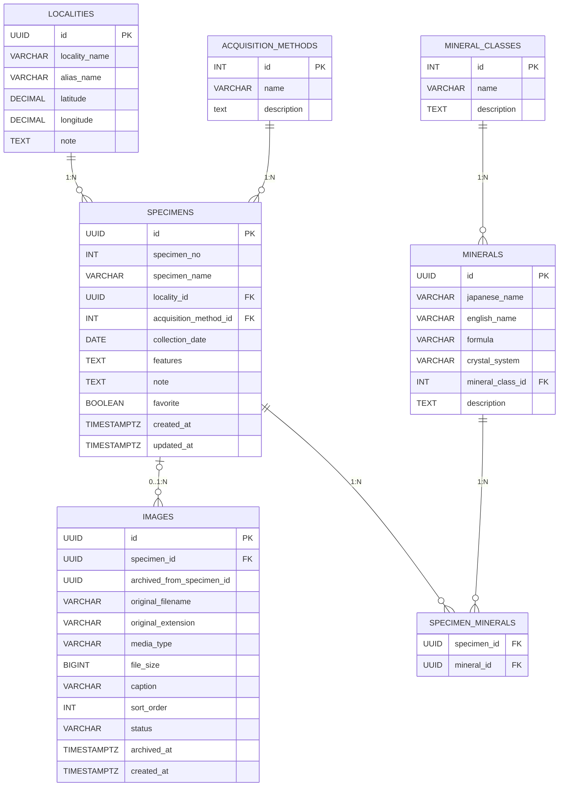

# ER図

```mermaid
erDiagram

    SPECIMENS {
        UUID id PK
        INT specimen_no
        VARCHAR specimen_name
        UUID locality_id FK
        INT acquisition_method_id FK
        DATE collection_date
        TEXT features
        TEXT note
        BOOLEAN favorite
        TIMESTAMPTZ created_at
        TIMESTAMPTZ updated_at
    }

    MINERALS {
        UUID id PK
        VARCHAR japanese_name
        VARCHAR english_name
        VARCHAR formula
        VARCHAR crystal_system
        INT mineral_class_id FK
        TEXT description
    }

    MINERAL_CLASSES {
        INT id PK
        VARCHAR name
        TEXT description
    }

    SPECIMEN_MINERALS {
        UUID specimen_id FK
        UUID mineral_id FK
    }

    LOCALITIES {
        UUID id PK
        VARCHAR locality_name
        VARCHAR alias_name
        DECIMAL latitude
        DECIMAL longitude
        TEXT note
    }

    ACQUISITION_METHODS {
        INT id PK
        VARCHAR name
        text description
    }

    IMAGES {
        UUID id PK
        UUID specimen_id FK
        UUID archived_from_specimen_id
        VARCHAR original_filename
        VARCHAR original_extension
        VARCHAR media_type
        BIGINT file_size
        VARCHAR caption
        INT sort_order
        VARCHAR status
        TIMESTAMPTZ archived_at
        TIMESTAMPTZ created_at
    }

    LOCALITIES ||--o{ SPECIMENS : "1:N"

    ACQUISITION_METHODS ||--o{ SPECIMENS : "1:N"

    SPECIMENS o|--o{ IMAGES : "0..1:N"

    SPECIMENS ||--o{ SPECIMEN_MINERALS : "1:N"

    MINERALS ||--o{ SPECIMEN_MINERALS : "1:N"

    MINERAL_CLASSES ||--o{ MINERALS : "1:N"

```
