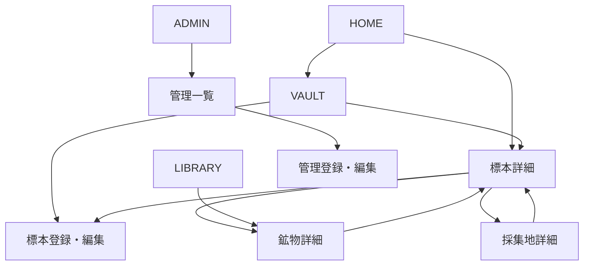

# 画面遷移とルーティング

## ルート

| 画面 | パス |
| --- | --- |
| HOME | `/` |
| VAULT | `/vault` |
| 標本詳細 | `/specimens/:id` |
| 標本登録・編集 | `/specimens/new`、`/specimens/:id/edit` |
| LIBRARY | `/library` |
| 鉱物詳細 | `/minerals/:id` |
| 採集地詳細 | `/localities/:id` |
| ADMIN | `/admin` |
| 管理一覧・登録・編集 | `/admin/:resource`、`/admin/:resource/new`、`/admin/:resource/:id/edit` |
| SETTING | `/settings` |

`resource` は `minerals`、`mineral-classes`、`localities`、`acquisition-methods` とする。

主要5画面はサイドメニューから相互に移動できる。共通ヘッダーから常に標本登録へ移動できる。一覧の検索条件、並び順、ページ番号はURLクエリに保持し、詳細から戻った際に復元する。登録成功後は作成した標本の詳細へ、編集成功後は対象の詳細へ移動する。
