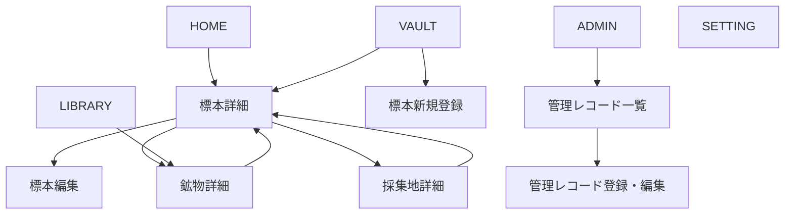

## 1. ドキュメント構成案

DB関連と画面関連を明確に分けるため、`docs/` 配下を設計領域ごとに分割する。

```text
docs/
├── README.md
│
├── db/
│   ├── index.md
│   ├── er-diagram.md
│   ├── relations.md
│   └── tables/
│       ├── specimens.md
│       ├── specimen_minerals.md
│       ├── minerals.md
│       ├── mineral_classes.md
│       ├── localities.md
│       ├── images.md
│       └── acquisition_methods.md
│
├── pages/
│   ├── index.md
│   ├── navigation.md
│   ├── common-layout.md
│   └── wireframes/
│       ├── home.md
│       ├── vault.md
│       ├── specimen-detail.md
│       ├── specimen-form.md
│       ├── library.md
│       ├── mineral-detail.md
│       ├── locality-detail.md
│       ├── admin.md
│       └── settings.md
│
├── api/
│   ├── index.md
│   ├── specimens.md
│   ├── minerals.md
│   ├── localities.md
│   ├── images.md
│   └── masters.md
│
└── development/
    ├── directory-structure.md
    ├── coding-rules.md
    └── implementation-plan.md
````

## 2. 画面設計の基本方針

本アプリケーションでは、以下の役割を明確に分離する。

| 領域      | 役割                  |
| ------- | ------------------- |
| HOME    | コレクションの入口となるダッシュボード |
| VAULT   | 所有する標本の保管・閲覧・登録・編集  |
| LIBRARY | 鉱物種そのものを調べる鉱物図鑑     |
| ADMIN   | マスタデータや一括データ操作の管理   |
| SETTING | 表示設定やアプリケーション設定     |

### VAULTとLIBRARYの違い

* `VAULT` は、自分が所有している実物の標本を扱う。
* `LIBRARY` は、石英や黄鉄鉱などの鉱物種そのものを扱う。

例：

```text
VAULT
└── 「長崎県西海市産 石英・緑泥石標本」

LIBRARY
├── 石英
└── 緑泥石
```

## 3. 共通画面構成

### 3.1 デスクトップレイアウト

```text
┌──────────────────────────────────────────────────────────────┐
│ APP TITLE / LOGO                              [＋ ADD SPECIMEN]│
├───────────────┬──────────────────────────────────────────────┤
│               │                                              │
│  HOME         │                                              │
│               │                                              │
│  VAULT        │               PAGE CONTENT                   │
│               │                                              │
│  LIBRARY      │                                              │
│               │                                              │
│  ADMIN        │                                              │
│               │                                              │
│  SETTING      │                                              │
│               │                                              │
├───────────────┴──────────────────────────────────────────────┤
│ VERSION / STORAGE STATUS / OTHER INFORMATION                 │
└──────────────────────────────────────────────────────────────┘
```

### 3.2 共通ヘッダー

ヘッダーには以下を配置する。

* アプリケーションタイトルまたはロゴ
* 現在のページタイトル
* 標本新規登録ボタン
* 必要に応じて戻るボタン
* 必要に応じてパンくずリスト

標本新規登録はVAULTだけに限定せず、主要画面から共通してアクセスできるようにする。

```text
[＋ ADD SPECIMEN]
```

遷移先：

```text
/specimens/new
```

### 3.3 サイドメニュー

```text
HOME
VAULT
LIBRARY
ADMIN
SETTING
```

選択中のメニューは背景色、左側のライン、アイコンなどで強調する。

## 4. ルーティング案

| 画面       | パス                          | 概要                |
| -------- | --------------------------- | ----------------- |
| HOME     | `/`                         | お気に入りや最近追加した標本を表示 |
| VAULT    | `/vault`                    | 標本一覧、検索、絞り込み      |
| 標本詳細     | `/specimens/:id`            | 個別標本の詳細表示         |
| 標本新規登録   | `/specimens/new`            | 標本の新規登録           |
| 標本編集     | `/specimens/:id/edit`       | 標本の編集             |
| LIBRARY  | `/library`                  | 鉱物種一覧、分類インデックス    |
| 鉱物詳細     | `/minerals/:id`             | 鉱物種の詳細表示          |
| 採集地詳細    | `/localities/:id`           | 採集地情報と関連標本を表示     |
| ADMIN    | `/admin`                    | 管理対象一覧            |
| 管理レコード一覧 | `/admin/:resource`          | 各データの一覧・管理        |
| 管理レコード登録 | `/admin/:resource/new`      | マスタデータの新規登録       |
| 管理レコード編集 | `/admin/:resource/:id/edit` | マスタデータの編集         |
| SETTING  | `/settings`                 | アプリケーション設定        |

## 5. 画面遷移



# 6. HOME

## 6.1 目的

コレクション全体への入口となるダッシュボード。

頻繁に見たい標本や、最近登録した標本へ素早くアクセスする。

## 6.2 表示要素

* お気に入りの標本
* 最近追加した標本
* VAULTへのリンク
* 標本新規登録ボタン
* 将来的には標本数などの簡易統計

「最近入手した標本」ではなく、「最近追加した標本」とする。

入手日が古い標本を後から登録する可能性があるため、登録日時を基準にする。

## 6.3 ワイヤーフレーム

```text
┌──────────────────────────────────────────────────────────────┐
│ HOME                                      [＋ ADD SPECIMEN]   │
├──────────────────────────────────────────────────────────────┤
│                                                              │
│ FAVORITES                                      [VIEW ALL →]  │
│                                                              │
│ ┌────────────┐ ┌────────────┐ ┌────────────┐                 │
│ │            │ │            │ │            │                 │
│ │   IMAGE    │ │   IMAGE    │ │   IMAGE    │                 │
│ │            │ │            │ │            │                 │
│ ├────────────┤ ├────────────┤ ├────────────┤                 │
│ │ No. 001    │ │ No. 014    │ │ No. 027    │                 │
│ │ 標本名     │ │ 標本名     │ │ 標本名     │                 │
│ │ 採集地     │ │ 採集地     │ │ 採集地     │                 │
│ └────────────┘ └────────────┘ └────────────┘                 │
│                                                              │
│ ┌────────────┐ ┌────────────┐ ┌────────────┐                 │
│ │   IMAGE    │ │   IMAGE    │ │   IMAGE    │                 │
│ │            │ │            │ │            │                 │
│ └────────────┘ └────────────┘ └────────────┘                 │
│                                                              │
│ RECENTLY ADDED                                 [VIEW ALL →]  │
│                                                              │
│ ┌────────────┐ ┌────────────┐ ┌────────────┐                 │
│ │   IMAGE    │ │   IMAGE    │ │   IMAGE    │                 │
│ │            │ │            │ │            │                 │
│ └────────────┘ └────────────┘ └────────────┘                 │
│                                                              │
│ ┌────────────┐ ┌────────────┐ ┌────────────┐                 │
│ │   IMAGE    │ │   IMAGE    │ │   IMAGE    │                 │
│ │            │ │            │ │            │                 │
│ └────────────┘ └────────────┘ └────────────┘                 │
│                                                              │
└──────────────────────────────────────────────────────────────┘
```

## 6.4 標本カードの表示項目

* お気に入り画像
* 標本番号
* 標本名
* 主な鉱物種
* 採集地
* お気に入り状態

画像が登録されていない場合は、共通のプレースホルダーを表示する。

# 7. VAULT

## 7.1 目的

所有している標本を保管・閲覧・検索・登録する中心画面。

検索はVAULT内の一機能として扱う。

## 7.2 表示要素

* キーワード検索
* 絞り込み条件
* 並び替え
* 表示形式切り替え
* 標本一覧
* 標本新規登録ボタン
* 検索結果件数

## 7.3 検索・絞り込み候補

* 標本番号
* 標本名
* 鉱物種
* 採集地
* 入手経路
* 入手日
* お気に入り
* 鉱物分類
* 結晶系

初期実装では条件を増やしすぎず、以下を優先する。

* キーワード
* 鉱物種
* 採集地
* お気に入り

## 7.4 ワイヤーフレーム

```text
┌──────────────────────────────────────────────────────────────┐
│ VAULT                                     [＋ ADD SPECIMEN]   │
├──────────────────────────────────────────────────────────────┤
│                                                              │
│ ┌────────────────────────────────────────────┐ [SEARCH]      │
│ │ 標本番号・標本名・鉱物種・採集地を検索     │               │
│ └────────────────────────────────────────────┘               │
│                                                              │
│ [鉱物種 ▼] [採集地 ▼] [入手経路 ▼] [★ お気に入り]          │
│                                                              │
│ 128 SPECIMENS                 [新しい順 ▼] [GRID] [LIST]     │
│                                                              │
│ ┌────────────┐ ┌────────────┐ ┌────────────┐                 │
│ │          ★ │ │            │ │            │                 │
│ │   IMAGE    │ │   IMAGE    │ │   IMAGE    │                 │
│ │            │ │            │ │            │                 │
│ ├────────────┤ ├────────────┤ ├────────────┤                 │
│ │ No. 001    │ │ No. 002    │ │ No. 003    │                 │
│ │ 標本名     │ │ 標本名     │ │ 標本名     │                 │
│ │ 鉱物種     │ │ 鉱物種     │ │ 鉱物種     │                 │
│ │ 採集地     │ │ 採集地     │ │ 採集地     │                 │
│ └────────────┘ └────────────┘ └────────────┘                 │
│                                                              │
│ ┌────────────┐ ┌────────────┐ ┌────────────┐                 │
│ │   IMAGE    │ │   IMAGE    │ │   IMAGE    │                 │
│ │            │ │            │ │            │                 │
│ └────────────┘ └────────────┘ └────────────┘                 │
│                                                              │
│                    [←] 1 2 3 4 5 [→]                         │
│                                                              │
└──────────────────────────────────────────────────────────────┘
```

## 7.5 一覧の表示形式

### グリッド表示

画像を中心に標本を視覚的に探す。

### リスト表示

情報量を増やし、標本番号や採集地などを比較しやすくする。

```text
┌──────┬────────┬────────────┬────────────┬────────────┐
│画像  │標本番号│標本名      │主な鉱物種  │採集地      │
├──────┼────────┼────────────┼────────────┼────────────┤
│IMAGE │001     │標本名      │石英        │長崎県...   │
│IMAGE │002     │標本名      │黄鉄鉱      │神奈川県... │
└──────┴────────┴────────────┴────────────┴────────────┘
```

# 8. 標本詳細

## 8.1 目的

個別標本の画像と登録情報をまとめて閲覧する。

## 8.2 表示要素

* 標本番号
* 標本名
* お気に入り状態
* 画像ギャラリー
* 鉱物種
* 伴う鉱物の説明
* 特徴
* 備考
* 採集地
* 地図
* 入手経路
* 入手日
* 編集ボタン
* 削除ボタン

## 8.3 ワイヤーフレーム

```text
┌──────────────────────────────────────────────────────────────┐
│ ← VAULT                                                       │
│                                                              │
│ No. 001  標本名                                   [★]        │
│                                  [EDIT] [DELETE]              │
├───────────────────────────────┬──────────────────────────────┤
│                               │                              │
│                               │ BASIC INFORMATION            │
│                               │                              │
│          MAIN IMAGE           │ 標本番号     001             │
│                               │ 標本名       標本名          │
│                               │ 入手日       2026-07-01      │
│                               │ 入手経路     採集            │
│                               │                              │
├───────────────────────────────┤                              │
│ [IMG] [IMG] [IMG] [IMG]       │                              │
└───────────────────────────────┴──────────────────────────────┘

┌──────────────────────────────────────────────────────────────┐
│ MINERALS                                                     │
│                                                              │
│ [石英] [緑泥石] [曹長石]                                    │
│                                                              │
│ 曹長石を伴うリチア電気石                                    │
└──────────────────────────────────────────────────────────────┘

┌──────────────────────────────────────────────────────────────┐
│ FEATURES                                                     │
│                                                              │
│ 標本の特徴を表示する。                                       │
└──────────────────────────────────────────────────────────────┘

┌──────────────────────────────────────────────────────────────┐
│ LOCALITY                                                     │
│                                                              │
│ 長崎県西海市雪浦                                             │
│ 別名・通称                                                   │
│                                                              │
│ ┌──────────────────────────────────────────────────────────┐ │
│ │                         MAP                              │ │
│ │                                                          │ │
│ │                          ●                               │ │
│ └──────────────────────────────────────────────────────────┘ │
│                                              [VIEW LOCALITY] │
└──────────────────────────────────────────────────────────────┘

┌──────────────────────────────────────────────────────────────┐
│ NOTE                                                         │
│                                                              │
│ 自由記述の備考を表示する。                                   │
└──────────────────────────────────────────────────────────────┘
```

## 8.4 操作

* 鉱物名を選択すると鉱物詳細へ遷移
* 採集地名または地図を選択すると採集地詳細へ遷移
* 画像を選択すると拡大表示
* お気に入りボタンで状態を切り替える
* 編集ボタンで標本編集画面へ遷移
* 削除ボタンで確認ダイアログを表示

# 9. 標本新規登録・編集

## 9.1 目的

標本情報、鉱物種、採集地、画像を一つの流れで登録・編集する。

新規登録と編集は同じフォームを再利用する。

## 9.2 フォーム構成

入力項目が多いため、セクションに分割する。

1. 基本情報
2. 鉱物情報
3. 採集地・入手情報
4. 画像
5. 特徴・備考

## 9.3 ワイヤーフレーム

```text
┌──────────────────────────────────────────────────────────────┐
│ ← BACK                                                       │
│ ADD SPECIMEN                                                 │
│                                                              │
│ [1. BASIC] [2. MINERALS] [3. LOCALITY] [4. IMAGES] [5. NOTE]│
├──────────────────────────────────────────────────────────────┤
│                                                              │
│ BASIC INFORMATION                                            │
│                                                              │
│ 標本番号 *                                                   │
│ ┌──────────────────────────────────────────────────────────┐ │
│ │ 001                                                      │ │
│ └──────────────────────────────────────────────────────────┘ │
│                                                              │
│ 標本名 *                                                     │
│ ┌──────────────────────────────────────────────────────────┐ │
│ │                                                          │ │
│ └──────────────────────────────────────────────────────────┘ │
│                                                              │
│ お気に入り                                                   │
│ [ OFF / ON ]                                                 │
│                                                              │
├──────────────────────────────────────────────────────────────┤
│ MINERALS                                                     │
│                                                              │
│ 鉱物種                                                       │
│ ┌──────────────────────────────────────────┐ [＋ ADD]        │
│ │ 鉱物種を検索・選択                       │                 │
│ └──────────────────────────────────────────┘                 │
│                                                              │
│ 選択済み： [石英 ×] [緑泥石 ×]                              │
│                                                              │
│ 関連鉱物の説明                                               │
│ ┌──────────────────────────────────────────────────────────┐ │
│ │ 曹長石を伴うリチア電気石                                 │ │
│ └──────────────────────────────────────────────────────────┘ │
│                                                              │
├──────────────────────────────────────────────────────────────┤
│ LOCALITY / ACQUISITION                                       │
│                                                              │
│ 採集地                                                       │
│ [採集地を選択 ▼]                           [＋ NEW LOCALITY] │
│                                                              │
│ 入手経路                                                     │
│ [採集 ▼]                                                     │
│                                                              │
│ 入手日                                                       │
│ [ YYYY / MM / DD ]                                           │
│                                                              │
├──────────────────────────────────────────────────────────────┤
│ IMAGES                                                       │
│                                                              │
│ ┌──────────────────────────────────────────────────────────┐ │
│ │              Drag & Drop or Select Files                │ │
│ └──────────────────────────────────────────────────────────┘ │
│                                                              │
│ [IMG ★] [IMG] [IMG] [IMG]                                   │
│                                                              │
│ ★：お気に入り画像                                            │
│                                                              │
├──────────────────────────────────────────────────────────────┤
│ FEATURES                                                     │
│ ┌──────────────────────────────────────────────────────────┐ │
│ │                                                          │ │
│ └──────────────────────────────────────────────────────────┘ │
│                                                              │
│ NOTE                                                         │
│ ┌──────────────────────────────────────────────────────────┐ │
│ │                                                          │ │
│ └──────────────────────────────────────────────────────────┘ │
│                                                              │
│                                      [CANCEL] [SAVE]         │
└──────────────────────────────────────────────────────────────┘
```

## 9.4 入力補助

鉱物種、採集地、入手経路などは、既存データから選択する。

必要なデータが存在しない場合は、登録作業を中断せず簡易登録できるようにする。

例：

```text
採集地を選択
├── 長崎県西海市雪浦
├── 神奈川県横須賀市
└── ＋ 新しい採集地を登録
```

ただし、鉱物分類など管理頻度の低いマスタは、ADMINから登録する。

# 10. LIBRARY

## 10.1 目的

鉱物種を図鑑として閲覧する。

所有標本ではなく、鉱物種そのものを中心に情報を整理する。

## 10.2 表示モード

* 鉱物名一覧（アルファベット順）
* 鉱物分類インデックス
* キーワード検索

## 10.3 ワイヤーフレーム

```text
┌──────────────────────────────────────────────────────────────┐
│ LIBRARY                                                      │
├──────────────────────────────────────────────────────────────┤
│                                                              │
│ ┌────────────────────────────────────────────┐ [SEARCH]      │
│ │ 鉱物名・英名・化学式を検索                 │               │
│ └────────────────────────────────────────────┘               │
│                                                              │
│ [MINERAL LIST] [CLASSIFICATION INDEX]                        │
│                                                              │
├──────────────────────┬───────────────────────────────────────┤
│ CLASSIFICATION       │ MINERALS                              │
│                      │                                       │
│ 1. 元素鉱物          │ A                                     │
│ 2. 硫化鉱物          │ ├── Actinolite / 緑閃石               │
│ 3. ハロゲン化鉱物    │ └── Albite / 曹長石                   │
│ 4. 酸化鉱物          │                                       │
│ 5. 炭酸塩鉱物        │ C                                     │
│ 6. 硫酸塩鉱物        │ ├── Calcite / 方解石                  │
│ 7. リン酸塩鉱物      │ └── Chlorite / 緑泥石                 │
│ 8. ケイ酸塩鉱物      │                                       │
│                      │ Q                                     │
│                      │ └── Quartz / 石英                     │
│                      │                                       │
└──────────────────────┴───────────────────────────────────────┘
```

## 10.4 鉱物カードまたは一覧項目

* 日本語名
* 英語名
* 化学式
* 結晶系
* 鉱物分類
* 所有標本数

# 11. 鉱物詳細

## 11.1 目的

鉱物種の基本情報と、その鉱物を含む所有標本を表示する。

## 11.2 ワイヤーフレーム

```text
┌──────────────────────────────────────────────────────────────┐
│ ← LIBRARY                                                    │
│                                                              │
│ 石英                                                         │
│ Quartz                                                       │
├──────────────────────────────────────────────────────────────┤
│                                                              │
│ 化学式       SiO₂                                            │
│ 結晶系       三方晶系                                        │
│ 鉱物分類     酸化鉱物                                        │
│                                                              │
│ DESCRIPTION                                                  │
│ 鉱物種の説明を表示する。                                     │
│                                                              │
└──────────────────────────────────────────────────────────────┘

┌──────────────────────────────────────────────────────────────┐
│ SPECIMENS IN YOUR VAULT                         12 SPECIMENS  │
│                                                              │
│ ┌────────────┐ ┌────────────┐ ┌────────────┐                 │
│ │   IMAGE    │ │   IMAGE    │ │   IMAGE    │                 │
│ │            │ │            │ │            │                 │
│ └────────────┘ └────────────┘ └────────────┘                 │
│                                                              │
│                                              [VIEW ALL →]    │
└──────────────────────────────────────────────────────────────┘
```

# 12. 採集地詳細

## 12.1 目的

採集地の名称、通称、位置情報、その場所に関連する標本を表示する。

独立したサイドメニューには置かず、標本詳細などから遷移する関連画面とする。

## 12.2 ワイヤーフレーム

```text
┌──────────────────────────────────────────────────────────────┐
│ ← BACK                                                       │
│                                                              │
│ 長崎県西海市雪浦                                             │
│ 通称：雪浦                                                   │
├──────────────────────────────────────────────────────────────┤
│                                                              │
│ ┌──────────────────────────────────────────────────────────┐ │
│ │                                                          │ │
│ │                         MAP                              │ │
│ │                          ●                               │ │
│ │                                                          │ │
│ └──────────────────────────────────────────────────────────┘ │
│                                                              │
│ 緯度：XX.XXXXXX                                              │
│ 経度：XX.XXXXXX                                              │
│                                                              │
└──────────────────────────────────────────────────────────────┘

┌──────────────────────────────────────────────────────────────┐
│ SPECIMENS FROM THIS LOCALITY                    8 SPECIMENS   │
│                                                              │
│ ┌────────────┐ ┌────────────┐ ┌────────────┐                 │
│ │   IMAGE    │ │   IMAGE    │ │   IMAGE    │                 │
│ └────────────┘ └────────────┘ └────────────┘                 │
└──────────────────────────────────────────────────────────────┘
```

# 13. ADMIN

## 13.1 目的

マスタデータと一括データ操作を管理する。

標本の日常的な登録・編集はVAULTで行い、ADMINでは行わない。

## 13.2 管理対象

* 鉱物種
* 鉱物分類
* 採集地
* 入手経路
* CSVインポート
* CSVエクスポート

画像や中間テーブルを直接操作する画面は、原則として設けない。

`images` と `specimen_minerals` は標本登録・編集画面を通して管理する。

## 13.3 ADMINトップ

```text
┌──────────────────────────────────────────────────────────────┐
│ ADMIN                                                        │
├──────────────────────────────────────────────────────────────┤
│                                                              │
│ DATA MANAGEMENT                                              │
│                                                              │
│ ┌──────────────────┐ ┌──────────────────┐                    │
│ │ MINERALS         │ │ MINERAL CLASSES  │                    │
│ │ 鉱物種を管理     │ │ 鉱物分類を管理   │                    │
│ │ 245 records      │ │ 10 records       │                    │
│ └──────────────────┘ └──────────────────┘                    │
│                                                              │
│ ┌──────────────────┐ ┌──────────────────┐                    │
│ │ LOCALITIES       │ │ ACQUISITION      │                    │
│ │ 採集地を管理     │ │ 入手経路を管理   │                    │
│ │ 32 records       │ │ 4 records        │                    │
│ └──────────────────┘ └──────────────────┘                    │
│                                                              │
│ IMPORT / EXPORT                                              │
│                                                              │
│ [CSV IMPORT] [CSV EXPORT]                                    │
│                                                              │
└──────────────────────────────────────────────────────────────┘
```

## 13.4 管理レコード一覧

```text
┌──────────────────────────────────────────────────────────────┐
│ ADMIN / MINERALS                               [＋ NEW]       │
├──────────────────────────────────────────────────────────────┤
│                                                              │
│ ┌────────────────────────────────────────────┐ [SEARCH]      │
│ │ 鉱物名を検索                               │               │
│ └────────────────────────────────────────────┘               │
│                                                              │
│ □  日本語名      英語名       化学式       分類      操作    │
│ ──────────────────────────────────────────────────────────── │
│ □  石英          Quartz       SiO₂         酸化鉱物 [EDIT]  │
│ □  黄鉄鉱        Pyrite       FeS₂         硫化鉱物 [EDIT]  │
│ □  方解石        Calcite      CaCO₃        炭酸塩   [EDIT]  │
│                                                              │
│ [DELETE SELECTED]                                            │
│                                                              │
└──────────────────────────────────────────────────────────────┘
```

## 13.5 削除時の考慮

関連データが存在するマスタについては、削除可否を明確に表示する。

例：

```text
この鉱物種は12件の標本から参照されているため削除できません。
```

または、削除前に代替データへの置換を促す。

# 14. SETTING

## 14.1 目的

アプリケーション全体の表示や保存に関する設定を行う。

## 14.2 初期実装の設定項目

* 表示モード

  * ライト
  * ダーク
  * システム設定に従う
* VAULTの初期表示

  * グリッド
  * リスト
* 一覧の表示件数
* 標本カードの表示項目

## 14.3 将来的な設定項目

* 画像保存先
* バックアップ
* データエクスポート
* 日付表示形式
* 言語設定

## 14.4 ワイヤーフレーム

```text
┌──────────────────────────────────────────────────────────────┐
│ SETTING                                                      │
├──────────────────────────────────────────────────────────────┤
│                                                              │
│ APPEARANCE                                                   │
│                                                              │
│ 表示モード                                                   │
│ (●) SYSTEM  ( ) LIGHT  ( ) DARK                              │
│                                                              │
│ VAULTの初期表示                                              │
│ (●) GRID    ( ) LIST                                         │
│                                                              │
│ 1ページの表示件数                                            │
│ [ 24 ▼ ]                                                     │
│                                                              │
│ 標本カードに表示する情報                                     │
│ [✓] 標本番号                                                 │
│ [✓] 鉱物種                                                   │
│ [✓] 採集地                                                   │
│ [ ] 入手日                                                   │
│                                                              │
│                                               [SAVE]         │
└──────────────────────────────────────────────────────────────┘
```

# 15. モーダル・ダイアログ

## 15.1 削除確認

```text
┌──────────────────────────────────────────┐
│ 標本を削除しますか？                     │
│                                          │
│ 関連する画像と鉱物種との対応情報も       │
│ 同時に削除されます。                     │
│                                          │
│                [CANCEL] [DELETE]         │
└──────────────────────────────────────────┘
```

`images` と `specimen_minerals` は、標本削除時にCASCADE DELETEされる。

画像ファイル本体については、DBレコードの削除とは別に、アプリケーション側でファイル削除処理を行う必要がある。

## 15.2 未保存変更の確認

```text
┌──────────────────────────────────────────┐
│ 変更内容が保存されていません。           │
│ このページを離れますか？                 │
│                                          │
│            [STAY] [LEAVE]                │
└──────────────────────────────────────────┘
```

## 15.3 画像拡大表示

```text
┌──────────────────────────────────────────────────────────────┐
│ [×]                                                          │
│                                                              │
│                         LARGE IMAGE                          │
│                                                              │
│                         [←] [→]                              │
└──────────────────────────────────────────────────────────────┘
```

# 16. 画面と主要テーブルの対応

| 画面      | 主に使用するテーブル                                                                      |
| ------- | ------------------------------------------------------------------------------- |
| HOME    | specimens, images, specimen_minerals, minerals, localities                      |
| VAULT   | specimens, images, specimen_minerals, minerals, localities                      |
| 標本詳細    | specimens, images, specimen_minerals, minerals, localities, acquisition_methods |
| 標本登録・編集 | specimens, images, specimen_minerals, minerals, localities, acquisition_methods |
| LIBRARY | minerals, mineral_classes, specimen_minerals                                    |
| 鉱物詳細    | minerals, mineral_classes, specimen_minerals, specimens, images                 |
| 採集地詳細   | localities, specimens, images                                                   |
| ADMIN   | minerals, mineral_classes, localities, acquisition_methods                      |
| SETTING | 原則としてDB外の設定ファイルまたはローカルストレージ                                                     |

# 17. 初期実装の優先順位

## Phase 1

* 共通レイアウト
* HOME
* VAULT一覧
* 標本詳細
* 標本新規登録
* 標本編集
* 標本削除

## Phase 2

* VAULT検索・絞り込み
* LIBRARY
* 鉱物詳細
* 採集地詳細

## Phase 3

* ADMIN
* CSVインポート・エクスポート
* SETTING
* バックアップ機能

# 18. 初期実装時の補足

最初からすべての画面を詳細に作り込まず、以下の主要動線を優先する。

```text
HOME
  ↓
VAULT
  ↓
標本詳細
  ↓
標本編集

VAULT
  ↓
標本新規登録
```

この動線が完成した後に、LIBRARY、採集地、ADMINへ展開する。